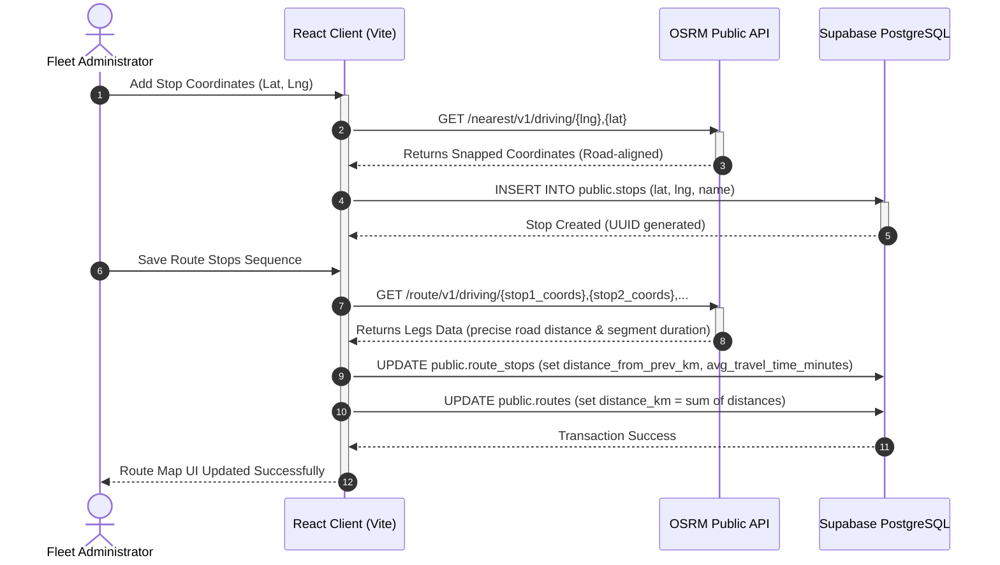
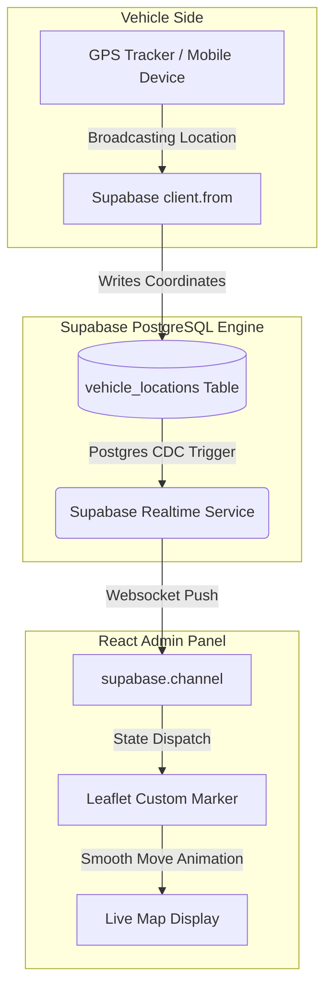
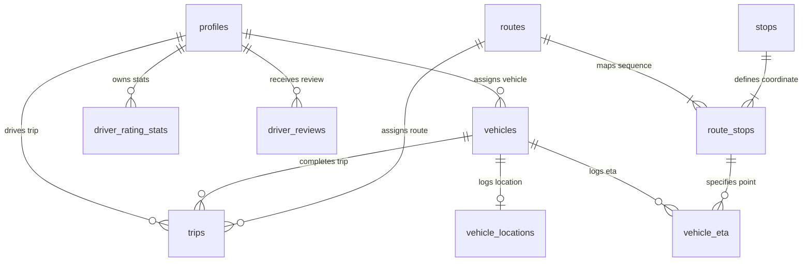

# 🚌 Safar Setu (City Transit Connect)
### Intelligent Fleet Tracking, OSRM Route Mapping, & Driver Safety Analytics Platform

[](https://react.dev/)
[](https://www.typescriptlang.org/)
[](https://vitejs.dev/)
[](https://supabase.com/)
[](https://leafletjs.com/)
[](http://project-osrm.org/)
[](https://vercel.com/)

Safar Setu is a comprehensive, production-ready public transit management web application and intelligent telemetry dashboard. Designed for modern transit authorities, Safar Setu bridges the gap between chaotic physical bus schedules and state-of-the-art telemetry by providing live vehicle location tracking, interactive node-based route mapping with automatic road-snapping, dynamic trip scheduling, and a detailed driver safety monitoring system using real-time passenger review feedback.

---

## 📌 Project Overview

### 📖 Purpose
Safar Setu ("The Bridge to Safe Journeys") was created to revolutionize the administrative oversight of public city bus networks. In developing regions, municipal bus services lack unified tracking platforms, resulting in scheduling overhead, unverified route distances, and no mechanism for passengers to report unsafe driving behavior. This portal provides fleet managers with high-fidelity GIS capabilities and driver safety analytics to dramatically improve operational efficiency and safety.

### ⚠️ Problem Statement
Modern public transit authorities face three critical challenges:
1. **Inefficient Route Design & Cost Estimation:** Administrators manually map bus stops but cannot verify precise drivable distances, leading to poor fuel cost estimates and inaccurate scheduling.
2. **Lack of Real-time Fleet Telemetry:** Dispatchers have no way to visually track active vehicles, calculate active delays, or detect route deviations.
3. **No Driver Safety Feedback Loop:** Driver rating schemes are traditionally non-existent or paper-based. Unsafe practices like sudden braking, overspeeding, and rash driving are rarely reported or systematically resolved.

### 🎯 Objectives
* **Automated Geographic Processing:** Integrate GIS mapping with OpenStreetMap and Open Source Routing Machine (OSRM) to snap manual stops to real-world roads and calculate route metrics automatically.
* **Real-time Synchronization:** Implement Postgres CDC websockets to track GPS coordinate updates from active buses instantly on an interactive operations map.
* **Granular Passenger Rating System:** Collect passenger safety metrics (smoothness, speed, hospitality, cleanliness) to calculate live driver safety scores (1-100) and alert dispatchers of rash driving behavior.
* **Secure Operational Control:** Safeguard transit assets, route data, and driver profiles using rigid Role-Based Access Control (RBAC) and Audit Logging.

---

## 🚀 Features

### 📊 Real-Time Operations Dashboard
* **Dynamic KPI Summaries:** High-contrast stats grid displaying *Total Fleet Buses*, *Active Running Trips*, *Configured Routes*, and *Online Drivers*.
* **Live Fleet Map Overlay:** Embeds a Leaflet-powered GIS container showing active bus markers that dynamically move across the city using Supabase WebSocket telemetry.
* **Recent Activity Log:** Feeds live updates of trip starts, completions, and scheduling actions directly on the dashboard page.
* **Interactive Data Table:** Quick-view grid listing active schedules, driver assignments, onward/return directions, and live status badges.

### 🗺️ OSRM-Powered Route Mapper
* **Interactive Stop Configurator:** Add, edit, or re-order stop sequences.
* **OSRM Nearest Snap API:** When coordinates are typed or selected, the app queries the OSRM nearest neighbor endpoint to snap coordinates to actual drivable pavement.
* **OSRM Route Leg Engine:** Calculates the exact road distance (in kilometers) and travel duration (in minutes) between consecutive stops in one single API request, updating the database automatically.
* **Directional Journey Support:** Fully supports `onward` and `backward` (return leg) parameters to support back-and-forth transit legs.

### 👥 Advanced Driver Safety Analytics
* **Driver Performance Aggregates:** Visual cards displaying average star rating, total reviews, and a computed safety score (100% baseline, decaying on complaints).
* **Granular Review Metrics:** Passengers submit specific boolean flags for *Rash Driving*, *Sudden Braking*, *Overspeeding*, *Polite Behavior*, and *Clean Bus*.
* **Status Badges:** Drivers are classified as `🟢 Safe Driver`, `🟢 Good Driver`, or `🔴 Rash Driving Complaints` based on ratings and safety logs.
* **Abusive Review Moderation:** Admins can flag reviews as spam or soft-delete abusive review entries to maintain dataset integrity.

### 🔒 Enterprise Security & Administration
* **Role-Based Routing:** Pages are protected by a custom React context handler that queries Supabase authentication profiles.
* **Auto-Logout for Breaches:** Non-admin accounts attempting to bypass client validation are instantly signed out.
* **Audit Tracing:** Dedicated Audit Logs screen recording system events and configuration overrides.

---

## 🛠️ Technology Stack

| Layer | Technology | Version | Purpose |
| :--- | :--- | :--- | :--- |
| **Frontend Core** | React | `^18.3.1` | Single Page Application architecture |
| **Language** | TypeScript | `^5.5.4` | Static typing and rigorous interface definitions |
| **Build Tool** | Vite | `^5.4.0` | Hot-reloading module bundler & build engine |
| **Database & Auth** | Supabase | `^2.45.0` | PostgreSQL hosting, Row-Level Security, and Realtime CDC |
| **GIS & Mapping** | Leaflet | `^1.9.4` | Raster map tiles management & coordinate plotting |
| **GIS React Wrappers** | React-Leaflet | `^4.2.1` | Declarative Leaflet integration with React lifecycle |
| **External Routing API** | OSRM Engine | `v1` (Public) | Coordinate road-snapping and road-network distance/duration |
| **Styling** | Custom HSL CSS | Vanilla CSS3 | Responsive glassmorphism system with dark/light themes |
| **Routing Engine** | React Router DOM | `^6.26.0` | Clientside SPA subroutes and Admin Route protection |
| **Hosting** | Vercel | Production | Serverless static hosting with index redirects |

---

## 📐 System Architecture

Safar Setu utilizes a client-serverless architecture. The React application communicates directly with Supabase's secure API backend, bypassing standard middleware endpoints in favor of Row-Level Security (RLS) policies. To execute intensive geospatial operations without heavyweight database extensions, the client acts as the orchestrator—merging spatial database queries with OSRM's routing engine.

### 🔄 Data Flow: OSRM Route-Snapping & Distance Calculation


### 🛰️ Live Telemetry & Real-Time Sync Flow


---

## 📂 Repository Structure

Below is the folder-wise layout of the repository:

```text
city-transit-connect-main/
├── .gitignore                      # Git ignored paths (node_modules, local secrets)
├── test-auth.js                    # Standalone Node script to test shadow user authentication
├── docs/                           # Database scripts and installation assets
│   ├── schema.sql                  # Primary PostgreSQL DDL Schema definition script
│   └── add_direction_column.sql    # Migration SQL patch adding trip backward directions
└── safar setu/                     # Primary Project Root Folder
    └── admin-web/                  # React + TypeScript Frontend Application
        ├── package.json            # Scripts, project metadata, and core dependency packages
        ├── tsconfig.json           # Compiler rules for TypeScript configuration
        ├── vite.config.ts          # Vite asset optimization plugins config
        ├── vercel.json             # Vercel Single Page App rewrite directives
        ├── index.html              # Core application HTML injection landing page
        └── src/                    # Source Directory
            ├── main.tsx            # Main bootstrap entry point
            ├── App.tsx             # Protected Admin Route Wrapper & central App router
            ├── index.css           # Glassmorphism Design Tokens & Vanilla CSS definitions
            ├── vite-env.d.ts       # Global TypeScript declaration mapping
            ├── components/         # Shared Functional Components
            │   ├── Sidebar.tsx     # Left navigability sidebar panel
            │   ├── Header.tsx      # Top operational bar with theme switcher
            │   ├── Layout.tsx      # Main structure joining Sidebar & Header
            │   ├── Modal.tsx       # Standard customized overlay dialog box
            │   ├── StatCard.tsx    # Display block for metric numbers
            │   ├── AccessDenied.tsx# Fallback screen for non-admin accounts
            │   └── RouteMapperModal.tsx # OSRM stop-snapping configuration editor
            ├── context/            # React Global State Providers
            │   └── AuthContext.tsx # Global GoTrue auth listener and role-checking cache
            ├── hooks/              # Custom React Hooks
            │   └── useSupabase.ts  # Generic API queries & automatic dashboard stat loading
            ├── lib/                # Third-Party API Configuration
            │   ├── supabase.ts     # Supabase DB Client initialization (URL, Anon key)
            │   └── api.ts          # Mutation routines (OSRM leg calculator & driver analytics)
            ├── pages/              # Primary Visual Layout Screens
            │   ├── Dashboard.tsx   # Fleet overview & Leaflet Mini Map
            │   ├── Buses.tsx       # Vehicle asset CRUD & Driver Allocator
            │   ├── RoutesPage.tsx  # Primary transit routes dashboard
            │   ├── Trips.tsx       # Schedules scheduler and status update logs
            │   ├── Drivers.tsx     # Comprehensive Reviews & rating moderation system
            │   ├── LiveMap.tsx     # Dedicated full-screen GIS fleet overview map
            │   ├── AuditLogs.tsx   # History of administrative updates
            │   └── Settings.tsx    # Profile details, security, and map center controls
            └── types/              # Static Type Declarations
                └── database.ts     # Strict TypeScript maps of PostgreSQL database tables
```

---

## ⚙️ Installation and Setup

Follow these steps to clone, configure, initialize, and deploy Safar Setu.

### 1. Prerequisites
Make sure you have the following installed on your machine:
* **Node.js** (v18.x or newer) - [Download](https://nodejs.org/)
* **npm** (v9.x or newer, bundled with Node)
* **Git** - [Download](https://git-scm.com/)
* A **Supabase Account** - [Sign Up](https://supabase.com/)

### 2. Clone the Repository
Open your terminal and run the following commands:
```bash
git clone https://github.com/[YOUR_USERNAME]/city-transit-connect.git
cd city-transit-connect
```

### 3. Initialize the Supabase Database
To replicate the schema on your Supabase project:
1. Log in to the [Supabase Dashboard](https://database.supabase.com/) and create a new project named `Safar Setu`.
2. Navigate to the **SQL Editor** tab from the left sidebar.
3. Open `docs/schema.sql` from your cloned folder, copy its contents, paste them into the editor, and click **Run**.
4. Open `docs/add_direction_column.sql` and run it to verify that the `direction` column is successfully added to the `trips` table.
5. *(Optional)* Add a dummy user in the **Authentication** tab to generate your initial admin user.

### 4. Configure Environment Variables
Inside the `safar setu/admin-web/` folder, find or create your client configurations.

> [!NOTE]
> In this repository, Supabase connection tokens are initialized in [supabase.ts](file:///c:/Users/anshu/Downloads/city-transit-connect-main/safar%20setu/admin-web/src/lib/supabase.ts). You can directly configure them or switch to standard Vite `.env` variables if desired:

To move them to a secure `.env` structure:
1. Create a file named `.env` in `safar setu/admin-web/`:
```env
VITE_SUPABASE_URL=https://[YOUR_SUPABASE_PROJECT_REF].supabase.co
VITE_SUPABASE_ANON_KEY=your_anon_public_key_here
```
2. Modify `safar setu/admin-web/src/lib/supabase.ts` to consume them:
```typescript
import { createClient } from '@supabase/supabase-js'

const SUPABASE_URL = import.meta.env.VITE_SUPABASE_URL
const SUPABASE_ANON_KEY = import.meta.env.VITE_SUPABASE_ANON_KEY

export const supabase = createClient(SUPABASE_URL, SUPABASE_ANON_KEY)
```

### 5. Install Dependencies & Run
Navigate to the web project directory, install packages, and boot up Vite:
```bash
cd "safar setu/admin-web"
npm install
npm run dev
```
Open [http://localhost:5173](http://localhost:5173) in your web browser.

### 6. Production Compilation
To compile optimized static bundles for production hosting:
```bash
npm run build
```
This command compiles and outputs static HTML, CSS, and JS assets into the `dist/` directory.

---

## 🗄️ Database Schema

Safar Setu operates on a highly normalized relational database. The tables are configured inside Supabase's `public` schema.



### 📋 Tables Dictionary

| Table Name | Description | Key Relationships | Critical Fields |
| :--- | :--- | :--- | :--- |
| **`public.profiles`** | Manages profiles for all user accounts including passengers, drivers, and admins. | `id` (Primary Key) | `name` (text), `phone` (text), `email` (unique), `role` (enum: 'admin', 'driver', 'passenger') |
| **`public.admin_users`** | Explicit verification list for administrators. | `user_id` ➔ `auth.users(id)` | `user_id` (uuid, PK) |
| **`public.vehicles`** | Stores the physical bus inventory details. | `driver_id` ➔ `profiles.id` | `vehicle_number` (unique), `capacity` (int), `vehicle_type` (default: 'bus') |
| **`public.routes`** | Contains transit route metadata. | `id` (PK) | `route_name` (text), `start_location` (text), `end_location` (text), `distance_km` (numeric) |
| **`public.stops`** | Geographic markers of transit stops. | `id` (PK) | `stop_name` (text), `latitude` (numeric), `longitude` (numeric) |
| **`public.route_stops`** | Map join defining the ordered stops list. | `route_id` ➔ `routes.id`<br>`stop_id` ➔ `stops.id` | `stop_order` (int), `distance_from_prev_km` (numeric), `avg_travel_time_minutes` (numeric) |
| **`public.trips`** | Dynamic journal schedules. | `vehicle_id` ➔ `vehicles.id`<br>`route_id` ➔ `routes.id`<br>`driver_id` ➔ `profiles.id` | `start_time` (timestamptz), `status` (enum: 'scheduled', 'running', 'completed'), `direction` ('onward'/'backward') |
| **`public.vehicle_locations`**| Telemetry data representing real-time vehicle positions. | `vehicle_id` ➔ `vehicles.id` (Unique) | `latitude` (numeric), `longitude` (numeric), `speed` (numeric), `heading` (numeric) |
| **`public.driver_rating_stats`** | Computed driver performance cache. | `driver_id` ➔ `profiles.id` | `average_rating` (numeric), `safety_score` (numeric), `rash_driving_count` (int) |
| **`public.driver_reviews`** | Granular review records submitted by passengers. | `driver_id` ➔ `profiles.id`<br>`trip_id` ➔ `trips.id` | `rating` (1-5), `rash_driving` (bool), `sudden_braking` (bool), `is_deleted` (bool) |

---

## 🔌 API & Integration Documentation

Safar Setu leverages direct database mutations and external geocoding interfaces. 

### 📡 1. OSRM API Integrations

#### **A. Stop Road-Snapping Endpoint**
* **External URL:** `http://router.project-osrm.org/nearest/v1/driving/{longitude},{latitude}`
* **Method:** `GET`
* **Utility:** Queries the OSRM road database to return the exact coordinate projection aligned to the nearest drivable asphalt.
* **Code Implementation:** Found in `snapCoordinatesToRoad()` inside `api.ts`.

#### **B. Route Coordinates Leg Aggregator**
* **External URL:** `http://router.project-osrm.org/route/v1/driving/{lng1},{lat1};{lng2},{lat2};...`
* **Method:** `GET`
* **Parameters:** `?overview=false`
* **Utility:** Processes the complete array of ordered stop coordinates to calculate accurate distances (meters) and traffic-free travel times (seconds) between successive nodes.
* **Code Implementation:** Found in `calculateAndStoreRouteDistances()` inside `api.ts`.

### 💾 2. Key Code Mutations (`api.ts`)

```typescript
// Add new vehicle record
export async function insertBus(data: { vehicle_number: string; capacity: number; driver_id?: string; vehicle_type?: string })

// Add stop and snap coordinates to nearest road
export async function insertStop(data: { stop_name: string; latitude: number; longitude: number })

// Calculate entire route segment metrics using OSRM
export async function calculateAndStoreRouteDistances(routeId: string, force?: boolean)

// Moderation: Soft delete user review
export async function deleteReview(reviewId: string)
```

---

## 🛰️ Hardware Integration (ESP32 GPS Tracker)

Safar Setu supports dedicated hardware-based GPS tracking using an **ESP32** microcontroller coupled with a **GPS module** (e.g., NEO-6M / NEO-M8N). This bypasses the need for a driver's mobile phone to transmit telemetry, providing a dedicated, robust IoT tracking solution.

> [!IMPORTANT]
> **Complete End-to-End Trip Tracking Workflow:**
> 1. **Admin Starts Trip:** The administrator initiates/starts the trip via the **Admin Website/Dashboard** (e.g., transitions a schedule to `running` on the `/trips` or `/dashboard` interface).
> 2. **Hardware Telemetry Activation:** Once the trip is active, the **ESP32 GPS Tracker** (installed on the physical bus and powered on) continuously reads satellite coordinates. If it has a valid satellite fix and a network connection, it continuously transmits telemetry data.
> 3. **Real-Time Synchronization & User View:** The coordinates are updated in the Supabase database. The **User Mobile App** and the **Admin Operations Dashboard** listen to these real-time Postgres CDC updates via WebSockets, dynamically showing the bus moving along the map in real-time.

---

### ESP32 Arduino Firmware Code

Below is the complete C++ firmware code to be flashed onto your ESP32. It reads serial NMEA data from the GPS, filters the GPS signal for quality, protects against anomalous location "jumps", and uploads the coordinates directly to the Supabase Edge Function.

```cpp
#include <WiFi.h>
#include <HTTPClient.h>
#include <TinyGPS++.h>
#include <HardwareSerial.h>

// ======================
// WiFi Credentials
// ======================
const char* ssid = "ENTER-YOUR-SSID";
const char* password = "ENTER PASSWORD";

// =================================
// Supabase Edge Function & Vehicle
// =================================
const char* serverURL =
  "https://rpqeavqoidtwfxzmdplb.supabase.co/functions/v1/update-location";

// The vehicle ID is taken directly from your Supabase Database (e.g., vehicles table)
const char* VEHICLE_ID =
  "997d05b5-0a0b-4e88-8a99-000354a8763d";

const char* API_SECRET =
  "gps_safarsetu_x9k2m7p4q1";

// ======================
// GPS
// ======================
TinyGPSPlus gps;
HardwareSerial gpsSerial(1);

// ======================
// Timing
// ======================
unsigned long lastSent = 0;
const unsigned long INTERVAL = 2000;

// ======================
// WiFi Reconnect
// ======================
unsigned long lastWifiCheck = 0;
const unsigned long WIFI_CHECK_INTERVAL = 5000;

// ======================
// Previous Coordinates
// ======================
float lastLat = 0;
float lastLng = 0;
bool hasPreviousLocation = false;

// ======================
// Setup
// ======================
void setup() {

  Serial.begin(115200);

  // GPS RX, TX
  gpsSerial.begin(9600, SERIAL_8N1, 16, 17);

  connectWiFi();

  Serial.println("GPS Tracking Started");
}

// ======================
// Main Loop
// ======================
void loop() {

  // Continuously parse GPS
  while (gpsSerial.available()) {
    gps.encode(gpsSerial.read());
  }

  // Reconnect WiFi if needed
  if (millis() - lastWifiCheck >= WIFI_CHECK_INTERVAL) {

    lastWifiCheck = millis();

    if (WiFi.status() != WL_CONNECTED) {

      Serial.println("WiFi disconnected. Reconnecting...");
      connectWiFi();
    }
  }

  // Process valid GPS updates
  if (
    gps.location.isValid() &&
    gps.location.isUpdated()
  ) {

    float lat = gps.location.lat();
    float lng = gps.location.lng();
    float speed = gps.speed.kmph();
    float heading = gps.course.deg();

    int satellites = gps.satellites.value();
    float hdop = gps.hdop.hdop();

    Serial.println("--------------------------------");
    Serial.println("Latitude: " + String(lat, 6));
    Serial.println("Longitude: " + String(lng, 6));
    Serial.println("Speed: " + String(speed));
    Serial.println("Heading: " + String(heading));
    Serial.println("Satellites: " + String(satellites));
    Serial.println("HDOP: " + String(hdop));
    Serial.println("Age: " + String(gps.location.age()));

    // ======================
    // GPS Quality Filtering
    // ======================
    bool gpsQualityGood =
      satellites >= 4 &&
      hdop > 0 &&
      hdop < 3 &&
      gps.location.age() < 3000;

    if (!gpsQualityGood) {

      Serial.println("Poor GPS quality. Skipping upload.");
      delay(10);
      return;
    }

    // ======================
    // Jump Protection
    // ======================
    if (hasPreviousLocation) {

      double distance =
        TinyGPSPlus::distanceBetween(
          lastLat,
          lastLng,
          lat,
          lng
        );

      // Reject impossible jump > 2km
      if (distance > 2000) {

        Serial.println("GPS jump detected!");
        Serial.println("Distance: " + String(distance));

        delay(10);
        return;
      }
    }

    // ======================
    // Send Every 2 sec
    // ======================
    if (millis() - lastSent >= INTERVAL) {

      sendLocation(
        lat,
        lng,
        speed,
        heading
      );

      lastLat = lat;
      lastLng = lng;
      hasPreviousLocation = true;

      lastSent = millis();
    }
  }

  delay(10);
}

// ======================
// WiFi Connect
// ======================
void connectWiFi() {

  WiFi.begin(ssid, password);

  Serial.print("Connecting to WiFi");

  unsigned long startAttempt = millis();

  while (
    WiFi.status() != WL_CONNECTED &&
    millis() - startAttempt < 10000
  ) {

    delay(500);
    Serial.print(".");
  }

  if (WiFi.status() == WL_CONNECTED) {

    Serial.println("\nWiFi connected!");
    Serial.println(WiFi.localIP());

  } else {

    Serial.println("\nWiFi connection failed");
  }
}

// ======================
// Send GPS Data
// ======================
void sendLocation(
  float lat,
  float lng,
  float speed,
  float heading
) {

  if (WiFi.status() != WL_CONNECTED) {

    Serial.println("No WiFi. Upload skipped.");
    return;
  }

  HTTPClient http;

  http.begin(serverURL);

  http.addHeader("Content-Type", "application/json");
  http.addHeader("x-api-secret", API_SECRET);

  // Reduced timeout
  http.setTimeout(3000);

  // ======================
  // JSON Payload
  // ======================
  String payload = "{";

  payload += "\"vehicle_id\":\"" + String(VEHICLE_ID) + "\",";
  payload += "\"latitude\":" + String(lat, 6) + ",";
  payload += "\"longitude\":" + String(lng, 6) + ",";
  payload += "\"speed\":" + String(speed, 1) + ",";
  payload += "\"heading\":" + String(heading, 1);

  payload += "}";

  Serial.println("Sending Location...");
  Serial.println(payload);

  int responseCode = http.POST(payload);

  Serial.println("Response Code: " + String(responseCode));

  if (responseCode > 0) {

    String response = http.getString();

    Serial.println("Response:");
    Serial.println(response);

  } else {

    Serial.println("HTTP Request Failed");
  }

  http.end();
}
```

---

### Code Explanation & Key Features

This IoT firmware is engineered specifically for vehicle tracking under real-world cellular/WiFi constraints. Here is a breakdown of how the firmware operates:

1. **Hardware Serial Setup & GPS Streaming (`setup` & `loop`)**:
   - `gpsSerial.begin(9600, SERIAL_8N1, 16, 17)` initializes standard hardware serial on pins `16` (RX) and `17` (TX) to receive raw NMEA sentences from the physical GPS module (such as the NEO-6M).
   - In the `loop()`, `gps.encode()` processes the incoming stream byte-by-byte in a non-blocking manner.
2. **Robust WiFi Auto-Reconnect**:
   - Every 5 seconds (`WIFI_CHECK_INTERVAL`), the device checks if the WiFi connection has dropped.
   - If disconnected, it attempts to reconnect in the background, ensuring tracking resumes automatically once the vehicle moves back into range without crashing the GPS processor.
3. **Strict GPS Quality Filtering**:
   - To prevent noisy or inaccurate drift coordinates from being uploaded, the code checks:
     - **Satellite Count (`satellites >= 4`)**: Verifies that the module has a solid 3D lock.
     - **HDOP (`0 < hdop < 3`)**: Horizontal Dilution of Precision must be less than 3, indicating high coordinate precision.
     - **Location Age (`gps.location.age() < 3000` ms)**: Ensures the data was acquired within the last 3 seconds.
4. **Sudden Jump Protection**:
   - GPS modules occasionally report massive "coordinate jumps" (multi-kilometer anomalies) due to signal reflection.
   - The firmware checks the distance between the current coordinate and the `lastLat`/`lastLng` using the Haversine calculation `TinyGPSPlus::distanceBetween`. If the distance is greater than **2,000 meters**, the update is flagged as a glitch and ignored.
5. **Rate-Limited Uploads**:
   - To conserve bandwidth and prevent database write congestion, coordinates are only dispatched once every **2 seconds** (`INTERVAL = 2000`).
6. **Supabase Secure POST Communication**:
   - An HTTP POST request containing the JSON payload (`vehicle_id`, `latitude`, `longitude`, `speed`, `heading`) is sent directly to the Supabase Edge Function (`update-location`).
   - The payload is authenticated using a custom header `"x-api-secret"`, which matches the environment variables configured in the Supabase project.
7. **Vehicle ID Mapping (`VEHICLE_ID`)**:
   - The unique `VEHICLE_ID` used in the telemetry payload is obtained directly from your **Supabase Database** (specifically from the `public.vehicles` table). This maps the live GPS hardware updates directly to the registered vehicle record in the transit management system.

---

## 📖 Usage Guide & Workflows

### 🛡️ Administrator Workflow
```text
1. Log In ➔ Authenticate via Auth portal (User gets verification from public.profiles metadata).
2. Manage Vehicles ➔ Access "/buses" to add vehicles, set capacities, and allocate drivers.
3. Establish Routes ➔ Go to "/routes" and register route start/end headings.
4. Set Up Stops ➔ Launch the Route Stop Mapper. Input stops sequentially. Coordinates will automatically snap to the physical road networks and populate distances.
5. Create Trips ➔ Go to "/trips" or Overview to schedule trips. Provide direction (onward/return).
6. Track Live Operations ➔ Open "/live-map" or Dashboard to track vehicles and review live speeds and schedules.
7. Moderation ➔ Navigate to "/drivers". Examine reviews and flag/delete spam feedback.
```

### 🚶 Passenger Feedback Loop
```text
1. Complete Trip ➔ Passenger rides on a scheduled trip (trips.status = 'running').
2. Open Review Form ➔ Scanning QR code on the bus opens the passenger rating portal.
3. Submit Flags ➔ Rates the trip (1-5 stars) and selects boolean issue categories:
   - Smooth Driving: True/False
   - Rash Driving: True/False (lowers safety score)
   - Clean Bus: True/False
4. Calculations Update ➔ Submission runs PostgreSQL triggers updating the 'driver_rating_stats' table.
5. Real-Time Alert ➔ Unsafe thresholds immediately trigger dashboard safety flags on the Admin Portal.
```

---

## 🌐 Deployment Details

Safar Setu is ready to be hosted as a Single Page Application.

### Vercel Deployment Steps:
1. Make sure your `vercel.json` is located in the `safar setu/admin-web/` root folder:
```json
{
  "rewrites": [
    { "source": "/(.*)", "destination": "/index.html" }
  ]
}
```
2. Push your project code to GitHub.
3. Connect your repository to **Vercel** and set the root directory configuration to `safar setu/admin-web/`.
4. Configure your environment variables on Vercel.
5. Click **Deploy**. Vercel will build the React-TypeScript bundle and launch it on your production domain.


---

## 🔒 Security Features

1. **Authentication System:** Integrated with Supabase GoTrue Auth featuring token-based authentication session persistence.
2. **Access Control:** Middleware guards ensure that only accounts with role fields matching `admin` in the `profiles` table can navigate to dashboard interfaces. 
3. **Data Protection & Sanitization:** SQL queries are sanitized using Supabase client libraries to prevent SQL injection. Review records are soft-deleted (`is_deleted = true`) to prevent data loss while shielding interfaces from spam.

---

## 🔮 Future Enhancements

* **Geofencing & Divergence Alerts:** Automate alerts when active buses deviate from their snapped OSRM paths.
* **Predictive ML ETAs:** Leverage historical trip legs data to compute predictive bus arrival times under traffic conditions.
* **Offline Telemetry Buffer:** LocalStorage-based tracking buffer for drivers to sync GPS updates during network drops.

---

## 👥 Team Information
* **Developer Name:** `Anshul Bhau ,Shivam Pandoh,Gokul Kangotra, Abhinandan Singh`
* **Project Mentor:** `Mr Anil Gupta`
* **Academic Institution:** `MIET Jammu`
* **Submission Category:** `Major Project `

---

## 📄 License
This project is licensed under the **MIT License** - see the [LICENSE](LICENSE) file for details.

---

## 🤝 Acknowledgements
* **Open Source Routing Machine (OSRM)** for providing free geocoding infrastructure.
* **OpenStreetMap contributors** for accessible spatial tiles.
* **Supabase** for providing high-fidelity PostgreSQL hosting and WebSocket channels.
* **Leaflet contributors** for making mapping interactive.
